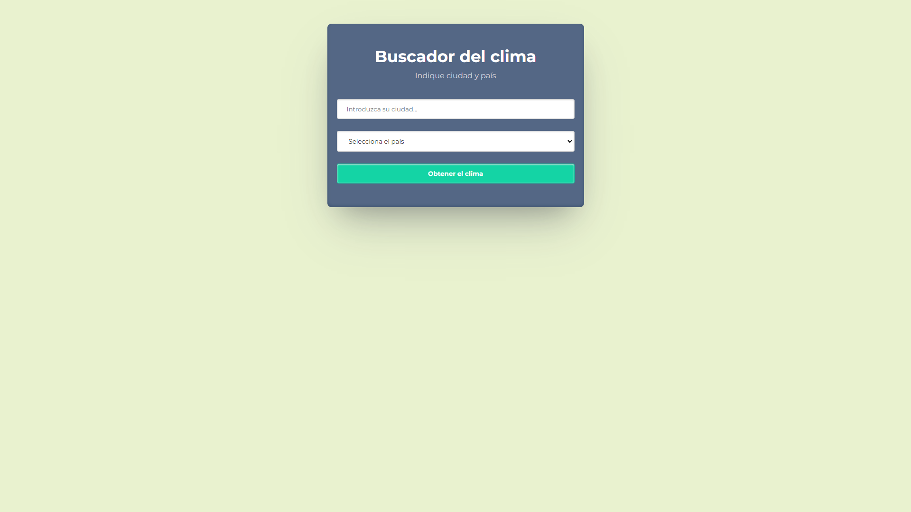
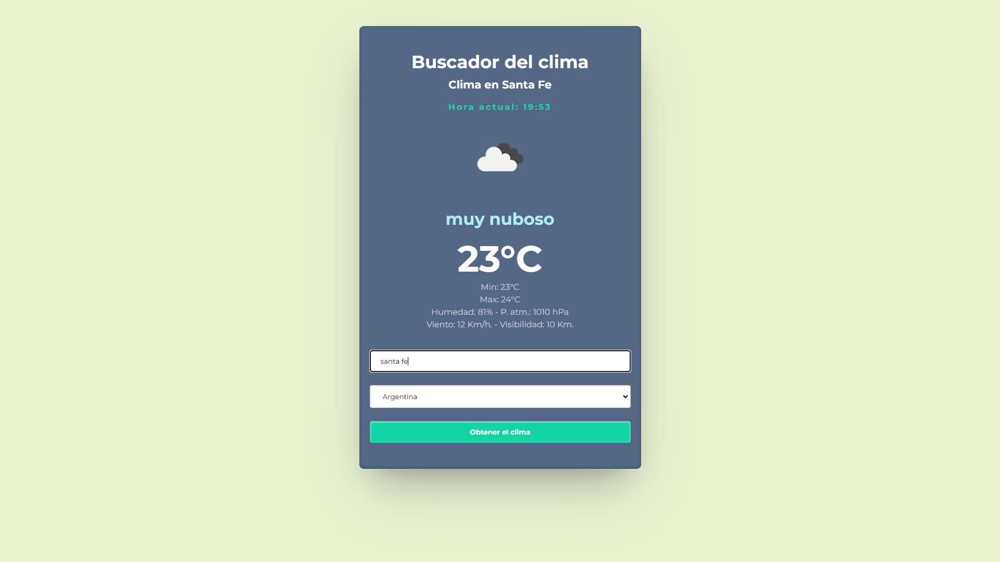

# Buscador del clima
### v. 1.0.0 

Es una aplicación sencilla desarrollada en HTML, CSS y Javascript.

*Por el momento solo devuelve datos actuales, en una próxima versión se podrá tener acceso a datos futuros del clima.*

Toma los datos de la API de [OpenWeather](https://openweathermap.org/) 

## Images
>Home page

>Respuesta

[Volver a LinkedIn](https://www.linkedin.com/in/gabrielnicolosi-fullstack-dev/)